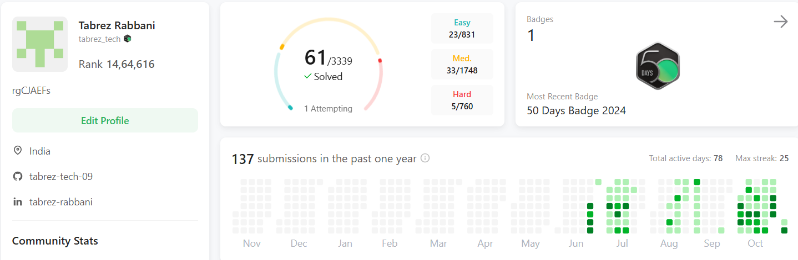

                     

<h1 align="center">Hi  I'm <b>Tabrez Rabbani</b></h1>
<h2 align="center"><b>I'm a Full Stack Java Developer & Software Engineer</b></h2>  

 
     
 
 
   

## 🙋‍♂️ About Me

- 🥋 I'm a very Passionate For Programming and Problem-Solving Enthusiast. I'm always ready to learn new things with Effective ideas. Hardcore DSA Enthusiast ❤️
- 👨‍💻 Love to learn new technologies and to explore new sets of areas.
- 👁‍🗨 Open Source Contributor  
- 🚀 Passionate About Crafting Efficient Code 
- 📘 I’m Currently Studying **Spring Boot**
  <!-- - 📘 I’m Currently learning **𝐌𝐄𝐑𝐍 𝐒𝐭𝐚𝐜𝐤 𝐃𝐞𝐯𝐞𝐥𝐨𝐩𝐞𝐦𝐞𝐧𝐭** -->
- 👯 I’m looking to collaborate on **OpenSource Projects**

## my DSA Badges @LeetCode
</img>

## 💻Use To Code

<!-- ## 🚀 Languages and Tools:

 
    
    
     
     
     
    
    
     
    
    
    
     
    
     
    
       
      
      
     
    

 -->
## 📊 My Github Stats

    
   

  
 
 

 
 

## 📈 Graph

   

## 📧 Connect with me:

